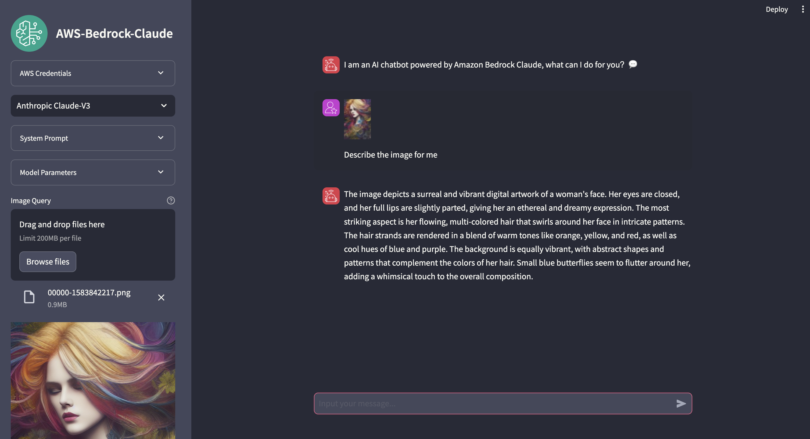

# Streamlit App for AWS Bedrock Claude  

### Prerequisite:
You need to get a valid authority for accessing Amazon Bedrock Claude model

### How to use:  
1. git clone the repo  

2. cd to the folder of repo  

3. pip install -r requirements.txt  

4. streamlit run bedrock_streamlit_converseAPI.py  

### Note:  
> Choose us-west-2 for using Anthropic Claude 3.5 Sonnet v2, and choose us-east-1 for using Amazon Nova series of models.

> The default credentials for App will be [environment variables](https://boto3.amazonaws.com/v1/documentation/api/latest/guide/credentials.html#environment-variables) or [shared credentials file](https://boto3.amazonaws.com/v1/documentation/api/latest/guide/credentials.html#shared-credentials-file), which are same with credentials for boto3 sdk. Besides, you can also provide your own AKSK with region info via App.  

> "bedrock_streamlit.py" was writen by InvokeModel API, "bedrock_streamlit_converseAPI.py" was writen by Converse API, and "bedrock_streamlit_converseAPI_secret.py" was added with login function

### App screenshot:
Chat with image and chat with document

